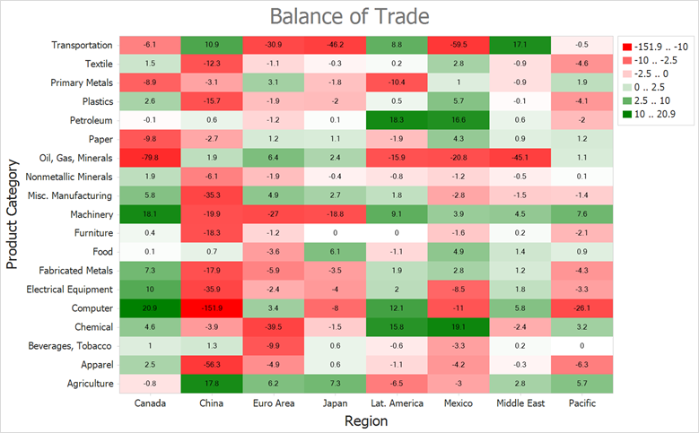

<!-- default badges list -->

<!-- default badges end -->

# How to Create a Heatmap Chart Based on a Data Source

This example shows how to create a heatmap and bind it to a data source. In this example, the heatmap obtains data from an XML file.

To bind a heatmap to a data source, follow the steps below:

- Create a [HeatmapDataSourceAdapter](https://docs.devexpress.com/CoreLibraries/DevExpress.XtraCharts.Heatmap.HeatmapDataSourceAdapter?v=21.2&p=netframework) object. 

- Specify adapter properties listed below:

    - [DataSource](https://docs.devexpress.com/CoreLibraries/DevExpress.XtraCharts.Heatmap.HeatmapDataSourceAdapter.DataSource?v=21.2)
    - [ColorDataMember](https://docs.devexpress.com/CoreLibraries/DevExpress.XtraCharts.Heatmap.HeatmapDataSourceAdapter.ColorDataMember?v=21.2)
    - [XArgumentDataMember](https://docs.devexpress.com/CoreLibraries/DevExpress.XtraCharts.Heatmap.HeatmapDataSourceAdapter.XArgumentDataMember?v=21.2)
    - [YArgumentDataMember](https://docs.devexpress.com/CoreLibraries/DevExpress.XtraCharts.Heatmap.HeatmapDataSourceAdapter.YArgumentDataMember?v=21.2)

- Assign the adapter object to the [HeatmapControl.DataAdapter](https://docs.devexpress.com/WindowsForms/DevExpress.XtraCharts.Heatmap.HeatmapControl.DataAdapter?v=21.2) property.

<!-- default file list -->
## Files to Look At

- [Form1.cs](./CS/Form1.cs) ([Form1.vb](./VB/Form1.vb))

<!-- default file list end -->

## Documentation

- [HeatmapControl](https://docs.devexpress.com/WindowsForms/DevExpress.XtraCharts.Heatmap.HeatmapControl?v=21.2&p=netframework)
- [HeatmapDataSourceAdapter](https://docs.devexpress.com/CoreLibraries/DevExpress.XtraCharts.Heatmap.HeatmapDataSourceAdapter?v=21.2&p=netframework)
